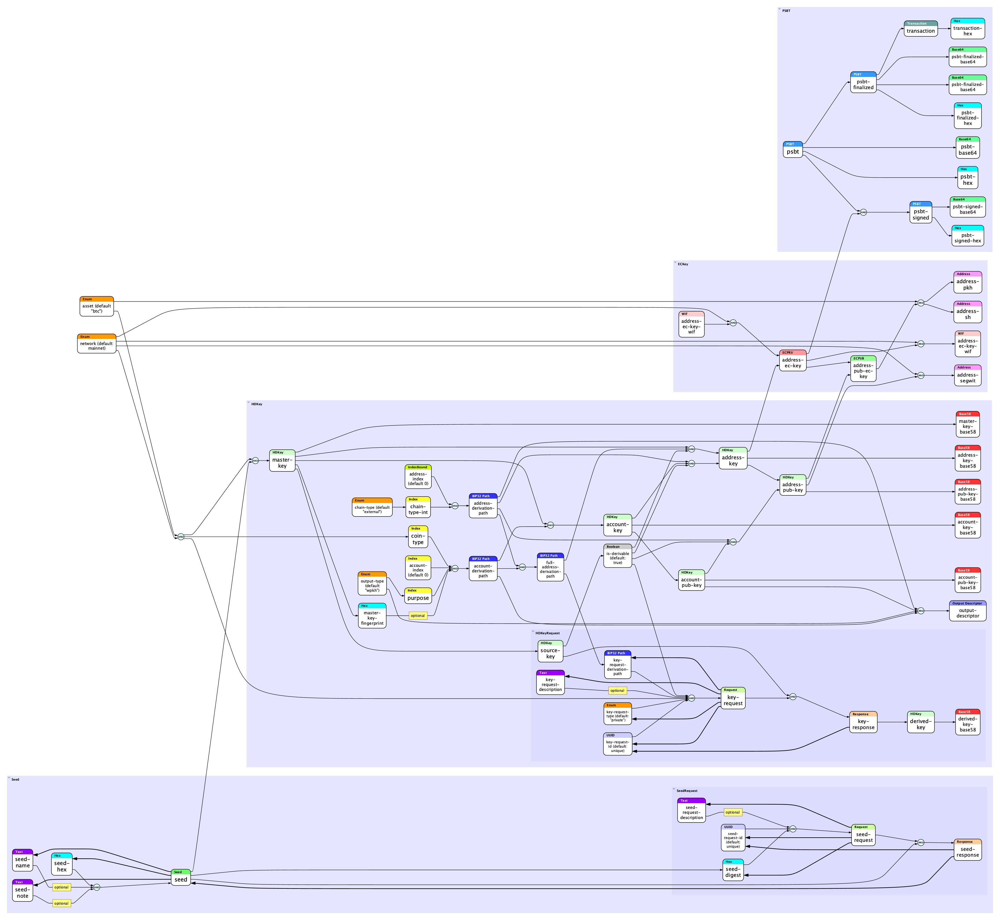

# 🔑 Keytool

**Version 0.2.0**<br/>**October 22, 2020**

*Copyright © 2020 by Blockchain Commons, LLC*<br/>*Licensed under the "BSD-2-Clause Plus Patent License"*

---

Keytool is a CLI tool that implements a data flow graph for deriving cryptocurrency keys and addresses.

As its inputs, Keytool can be supplied with any of the attributes for the nodes, and as its outputs Keytool can be asked for any of the attribues of the existing or derivable nodes. In this way, Keytool can implement a very short derivation such as "Derive a master HD key from a seed," or a long sequence of derivations from a seed all the way to a payment address, also outputting any of the intermediate steps along the way.

## Derivations

Below are the single-step derivations that Keytool performs, in the form `A <- [B, C, ...]` where `A` is the derived attributed and `[B, C, ...]` are the attribues required to derive it.

If an attribute is listed more than once, then it has more than one derivation path. If the first derivation path cannot be used, the second one will be tried.

All the attributes except `entropy` are either derivable from other attributes or have a default value. The default values are suitable for use with Bitcoin mainnet. If these attributes are supplied on the command line, they override the defaults.

```
seed
asset (default: btc)
network <- [asset]
master-key <- [network, seed]
master-key-fingerprint <- [master-key]
output-type (defult: wpkh)
purpose <- [output-type]
coin-type <- [asset]
account-index (default: 0)
account-derivation-path <- [master-key-fingerprint, purpose, coin-type, account-index]
account-key <- [master-key, account-derivation-path]
account-pub-key <- [account-key]
chain-type (default: external)
chain-type-int <- [chain-type];
address-index (default: 0)
address-derivation-path <- [chain-type-int, address-index]
full-address-derivation-path <- [account-derivation-path, address-derivation-path]
address-key <- [master-key, full-address-derivation-path]
address-key <- [account-key, address-derivation-path]
address-pub-key <- [address-key]
address-pub-key <- [account-pub-key, address-derivation-path]
address-ec-key <- [address-key]
address-ec-key <- [address-ec-key-wif]
address-ec-key-wif <- [address-ec-key, network]
address-pub-ec-key <- [address-ec-key]
address-pub-ec-key <- [address-pub-key]
address-pkh <- [address-pub-ec-key, asset]
address-sh <- [address-pub-ec-key, asset]
output-descriptor <- [output-type, account-derivation-path, address-derivation-path, account-pub-key]
```

These derivations are expressed visually in the graph below. Each node in the graph is a specific attribute that can be supplied directly on the command line, or derived from its predecessors. Two or more arrows entering a node indicate more than one possible set of inputs can be used to derive it. AND junctors indicate that *all* predecessor attributes must be supplied, unless a predecessor is marked `optional`.



## Formats

Keytool uses particular text formats for input and output attributes:

* HEX: A string of hexadecimal digits. Case-insensitive. The number of digits must be even.
* ENUM: A specific, defined enumerated value. For example `asset` can currently have the value `btc` (Bitcoin) or `btct` (Bitcoin testnet).
* INDEX: A non-negative integer.
* INDEX_BOUND: An INDEX or the wildcard `*` (note that on the Unix command line, you will need to enclose `*` in single quotes to avoid shell globbing.)-
* BIP32_PATH: A series of BIP-32 path elements, starting with `m` (for "master key") and followed by integers, which may optionally be followed by `h` (for hardened derivation). Example: `m/44h/0h/0h/0/123`.
* XPRV: A BIP-32 HD private key starting with `xprv`.
* XPUB: A BIP-32 HD public key starting with `xpub`.
* ECPRV: An elliptic curve private key in hex format.
* ECPUB: A compressed elliptic curve public key in hex format.
* WIF: An elliptic curve private key in Wallet Import Format.
* ADDRESS: An address in base-58 check format.

## Usage

```
$ keytool
    [-?V]
    [--account-derivation-path=BIP32_PATH]
    [--account-index=INDEX]
    [--account-key=XPRV]
    [--account-pub-key=XPUB]
    [--address-derivation-path=BIP32_PATH]
    [--address-ec-key=ECPRV]
    [--address-ec-key-wif=WIF]
    [--address-index=INDEX_BOUND]
    [--address-key=XPRV]
    [--address-pkh=ADDRESS]
    [--address-pub-ec-key=ECPUB]
    [--address-pub-key=XPUB]
    [--address-sh=ADDRESS]
    [--asset=ENUM btc|btct]
    [--chain-type=ENUM internal|external|identity]
    [--chain-type-int=INDEX]
    [--coin-type=INDEX]
    [--full-address-derivation-path=BIP32_PATH]
    [--master-key=XPRV]
    [--master-key-fingerprint=HEX]
    [--network=ENUM mainnet|testnet]
    [--output-descriptor=OUTPUT_DESCRIPTOR]
    [--output-type=ENUM pkh|wpkh|sh-wpkh]
    [--purpose=INDEX]
    [--seed=HEX]
    [--help]
    [--usage]
    [--version]

    output-attributes...
```

## Example Usages

### Derive master HD key from seed

```
$ keytool \
    --seed 1eb5338edac6fae54cbb172091ae6c1a \
    --asset btc \
    master-key

xprv9s21ZrQH143K4FAunaSG9eYwrAaaChpSYwYF22eJiZJrz5zSBKTg7NJcFqWR2UZc7EhneSMJhHLmPsKx96UDgv9CdoLc6JfQo3AncKhYNSc
```

### Derive address #1234 of account #0 private key from master HD key

```
$ keytool \
    --master-key xprv9s21ZrQH143K4FAunaSG9eYwrAaaChpSYwYF22eJiZJrz5zSBKTg7NJcFqWR2UZc7EhneSMJhHLmPsKx96UDgv9CdoLc6JfQo3AncKhYNSc \
    --address-index 1234 \
    address-key

xprvA33qYVBGLwEiCQNFTTpga5EHqJy1EnswzgzuSsBC3tPqz29qQ8PGDwyNuwearjiReYB8DK7nbJj52gKLjvGXsUx7RqmqtVgaYMun9CCQ3h8
```

### Derive an arbitrary BIP32 private and public keys from master HD key

```
$ keytool \
    --master-key xprv9s21ZrQH143K4FAunaSG9eYwrAaaChpSYwYF22eJiZJrz5zSBKTg7NJcFqWR2UZc7EhneSMJhHLmPsKx96UDgv9CdoLc6JfQo3AncKhYNSc \
    --full-address-derivation-path m/99h/1h/2h/3 \
    address-key \
    address-pub-key

xprv9zvzy7RBcHUqSY5uPpz5jMgA4f98yCxW21Qrwg5qQu3GcqTSBsAgpRXfTnmE4SqSbLJVHx4NdWFEc1CzwVps15ynZtFPEtpaNh9uDkd3auw
xpub6DvMNcx5Sf38f2ANVrX66VctcgydNfgMPELTk4VSyEaFVdnajQUwNDr9K54VQ2SRM7gmcQmJcMa23xyWEwU2ehdU9tgFBozSUnLaWJAhmBk
```

* Note: Since `'` is a UNIX command-line quote mark, BIP32 paths given to Keytool use `h` to denote hardened derivations.

### Derive 10 successive bitcoin addreses from a seed

```
for (( i=0; i <= 9; ++i ))
do
    keytool \
    	--seed 1eb5338edac6fae54cbb172091ae6c1a \
    	--address-index $i \
    	address-index \
    	full-address-derivation-path \
    	address-pkh
done

0
c1859926/84h/0h/0h/0/0
17u4HStkGWxJ5PtNqzCMEKRzaPJ8h35eBc
1
c1859926/84h/0h/0h/0/1
1JyxrbHYS7ZGhq68JewhJAMWka38Bv8tFw
2
c1859926/84h/0h/0h/0/2
1Agp5QYUPXWT2PLQtqHezQB8oChEBCTmnk
3
c1859926/84h/0h/0h/0/3
1Jauyj8uiz5YwWKq6kcP5jNKxEigLYAo35
4
c1859926/84h/0h/0h/0/4
15ccuKzfmJQ6GSLzbgcUYwjKkkEdKt1ELf
5
c1859926/84h/0h/0h/0/5
1CTnrP3Pwrd3Xf77rvh4XuhJJDpyiV2PGe
6
c1859926/84h/0h/0h/0/6
19pbYMfrNUJesmyUTxVxHVHRfFwkRhPXmK
7
c1859926/84h/0h/0h/0/7
141Wb2o9u22XFiiQXo4RQhCWRefKiUU8GJ
8
c1859926/84h/0h/0h/0/8
171m44xH6vs5yJmRdY8mEf8zVAUr5ka8SA
9
c1859926/84h/0h/0h/0/9
1BHXRjigSLZLt8Z7Rss27u6kZA17Pptpga
```

Note the following:

* When more than one output is requested, each output is printed in the order requested on a separate line.
* Supplied results, like `address-index`, or intermediate derived results, like `full-address-derivation-path` can also be requested.

### Derive an output descriptor for an account

Output descriptors are described [here](https://github.com/bitcoin/bitcoin/blob/master/doc/descriptors.md) and [here](https://bitcoinops.org/en/topics/output-script-descriptors/). Keytool currently supports `pkh`, `wpkh`, and `sh-wpkh` (`wpkh` nested within `sh`) output descriptor types.

The `address-index` node is set to the wildcard `*` so the returned output descriptor indicates that all address indexes are valid. The asterisk is single-quoted `'*'` to avoid shell globbing.

This example provides a seed, specifies an output descriptor type of `wpkh`, and specifies that any address index is usable. It outputs a descriptor containing the type, the fingerprint of the master key derived from the provided seed, the derivation path of the account key, the account public key, and the derivation path that will be used to derive addresses.

```
$ keytool \
    --seed 1b1454fab426f2729ddcec1b2a6fb539aa2ff0a36d078902994e2fde561d6550 \
    --address-index '*' \
    output-descriptor
wpkh([01577231/84h/0h/0h]xpub6CaE5t6vuSJpRZ4mUb8SX27bmZcinKzUfpn2ZFMYTK81vvrrA9XJZyT8bypiz7gMsjPnpdAJDaQDwvsErnAYi9ZFbDSSSxKR7PtM8msR29D/0/*)
```

## Providing Inputs via STDIN

When providing inputs to Keytool, any input values provided as an empty string are then expected via STDIN:

```
CLI:    $ keytool --seed '' master-key
STDIN:  8935a8068526d84da555cdb741a3b8a8
STDOUT: xprv9s21ZrQH143K3rJgfaUmUCueBxbDT1bbksxayh7ik1nZN41zAy2kQNop8REXEAAwqwes1E8rxk1313tyzsNmMq69h4vDyyrXkmjDZ2Nf3pN
```

You can of course use argument replacement with Seedtool to generate a seed, and from that a master key in one line:

```
$ keytool --seed `seedtool` master-key
xprv9s21ZrQH143K3SEi9YN67JXQxHRY4F2ignHZJxtVfMEh5D4NKcUYHrn75rZyt8nLMfzBc1enHGz9hqsbP98rp8i12DaiyYygUiss8YJ5qDC
```

Because you can provide inputs on STDIN, you can also use the shell to pipe the result of Seedtool to Keytool:

```
$ seedtool | keytool --seed '' master-key
xprv9s21ZrQH143K2QkBam5u1X5gwoLTvfk7QE2pfbr8ePDPNW4dZ6cmDtXgcRwjFBvPU1L8hC5o4nzxJB7L9hAzTY1VvHmo6M1EdTPfwxF15Bs
```

You can use Keytool to print out both the seed generated by Seedtool and the master key:

```
$ seedtool | keytool --seed '' seed master-key
9c802cc9fe2fee3fc9c75550f36dbc48
xprv9s21ZrQH143K2xbqevShzSjm4RCpeBgVfhM9enjHfrPpKnuH3f4NZYSHLFeoDYtRSQWCw1Df4xGkK2FjJQZTFYLNovKEJZrToCFMjH6xkp9
```

Other scripts can provide all the necessary inputs to keytool:

```
$ { seedtool && echo 'btct'; } | keytool --seed '' --asset '' master-key
tprv8ZgxMBicQKsPd1ieDbsts8QA9LzMbaeYE5pw7wL9k1QNteoZSbo62XK3HuP2WqByrRnBasP4jjEJUBf9mQSZVCCtMFAtSargNrByCkfFXh8
```

## Version History

### 0.2.1, 10/22/2020

* Renamed `output-descriptor-type` to `output-type`.
* Made `purpose` dependent on `output-type`.
* Changed default `output-type` to `wpkh`.

### 0.2.0, 10/22/2020

* Support for `output-descriptor`.

### 0.1.0, 9/28/2020

* First testing release.
